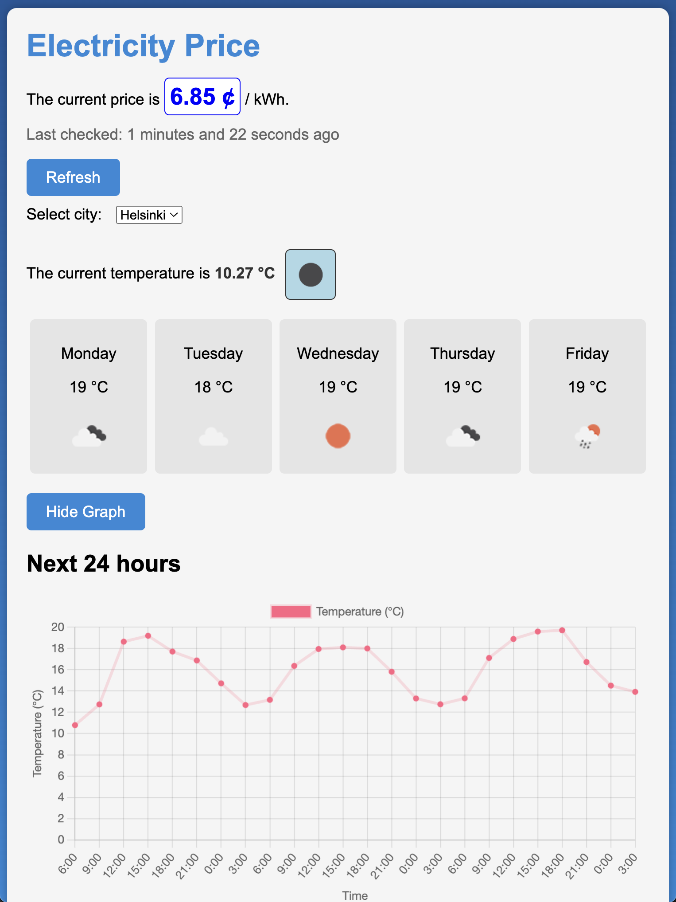

# info-hub
Dashboard for useful daily home data created using Node.js and React.



## Todo

- [x] Fetch and display current electricity price
- [x] Display weather conditions
- [ ] Settings/UI preferences
- [ ] Notifications for electricity price
- [ ] Notifications for weather conditions
- [ ] Data visualization
- [ ] AirThings integration for air quality

## Getting Started
# Linux/macOS
Run frontend and backend
```
cd frontend
npm install
npm start
```
Add a .env file in backend/ and add OPENWEATHERMAP_API_KEY={your key here} 
```
cd backend
npm install
npm start
```
